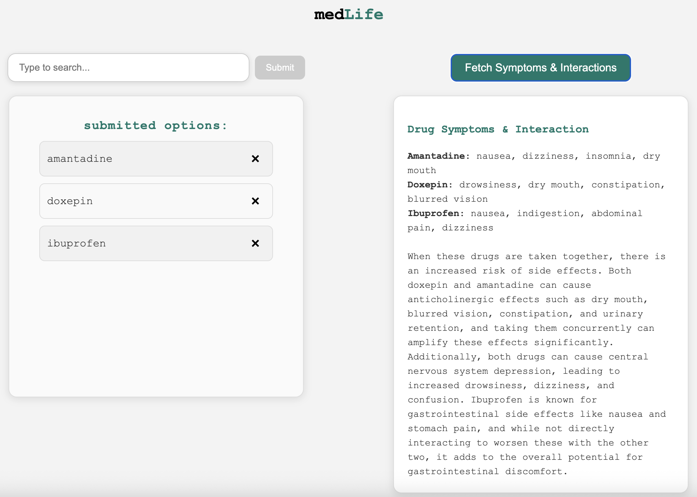

# HackPrinceton Spring 2025
Team: Harrison Xu, Tomasz Sadowy, Angus Cheng, Bryant Figueroa

# MedLife

## Motivation
Each year, thousands of adverse drug reactions occur because patients take medications that interact in harmful ways. Most existing tools for checking drug interactions are either overly technical or inaccessible to the general public.  
Our team built **MedLife** to make medication safety more approachable, empowering users to quickly understand how their prescriptions might interact and when they should consult a doctor.

---

## What Our App Does
**MedLife** allows users to enter the list of drugs they’re currently taking and receive instant feedback about potential drug–drug interactions.

- Users input medication names through a simple, intuitive interface.  
- An AI model analyzes the combination and explains possible conflicts and side effects in natural language.  
- The platform emphasizes transparency: each response is generated with clear explanations to help users understand the reasoning behind potential interactions.

Our system aims to provide **accessible, educational, and responsible** AI assistance rather than clinical diagnosis.

---

## Future Improvements
While the current version leverages a general-purpose AI model for interaction insights, our next step is to **replace this with a custom model trained on a CDC-curated drug interaction dataset**.

- This model will specialize in **structured pharmacological relationships**, improving precision and consistency.  
- It will support **offline querying**, enabling faster and privacy-preserving predictions.  
- Ultimately, we plan to extend it into a **recommendation system** that suggests safe alternatives or dosage adjustments.

---

